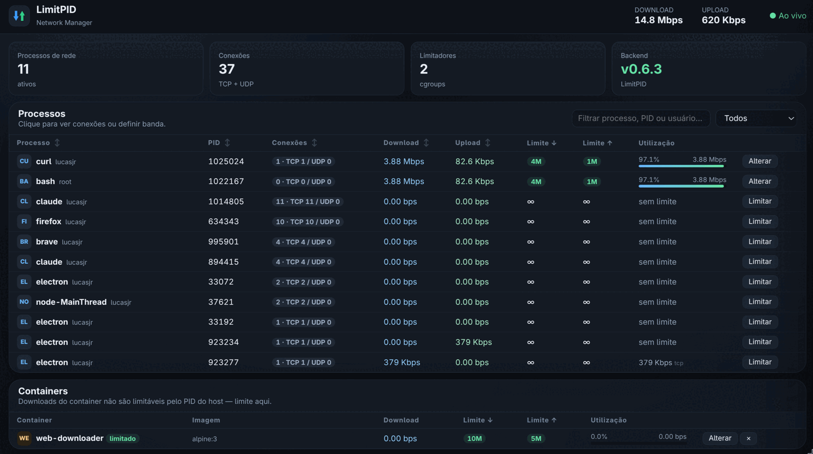

# LimitPID

**English** · [Português](README.pt-BR.md)

Per-process and per-Docker-container bandwidth control for Linux, built on
**cgroup v2 + eBPF**.

No `tc`, no `iptables`, no `nftables`, no systemd unit. Nothing persists: every limit
disappears on reboot — that is deliberate (see *Ephemerality*).

- **Backend**: `limitpid` — a Bash script that compiles, loads and manages eBPF
  (`cgroup_skb`) programs, with C and Python embedded in it.
- **GUI** (optional): Electron + Express + WebSocket.

```
┌─────────────┐    ┌───────────┐    sudo   ┌────────────────────┐    ┌──────────┐
│ electron.js │───▶│ server.js │──────────▶│ limitpid-gui-helper│───▶│ limitpid │
└─────────────┘    └───────────┘           │ (bash, validation) │    │ (backend)│
                         │                 └────────────────────┘    └──────────┘
                         └──▶ public/ (index.html, app.js, app.css)
```

The backend is fully usable on its own from the command line. The GUI is convenience.



Above: `curl` and `bash` capped at **4M ↓ / 1M ↑**, both running at **97.1%** of their
ceiling — the utilization bar comes from the eBPF counters, which are exact. The container
`web-downloader` is capped at **10M / 5M** and idle at capture time. The other processes
show `∞` because they have no limiter; their rate comes from `tcp_info`, hence the `tcp`
marker.

---

## Table of contents

- [What it does — and what it does not](#what-it-does--and-what-it-does-not)
- [Requirements](#requirements)
- [Installing from scratch](#installing-from-scratch)
- [Proving it works](#proving-it-works)
- [Usage — per process (PID)](#usage--per-process-pid)
- [Usage — per Docker container](#usage--per-docker-container)
- [Usage — per systemd service](#usage--per-systemd-service)
- [When the limit does NOT apply](#when-the-limit-does-not-apply)
- [The GUI](#the-gui)
- [Ephemerality](#ephemerality)
- [Security model](#security-model)
- [Diagnostics and common problems](#diagnostics-and-common-problems)
- [Uninstalling](#uninstalling)
- [Known limitations](#known-limitations)
- [Repository layout](#repository-layout)
- [Development](#development)

---

## What it does — and what it does not

**It does**

- Cap download and upload for a **process** and every child of it.
- Cap download and upload for a whole **Docker container**, including downloads
  **already in flight**, without dropping a single connection.
- Change a limit live (`change`), cutting nothing.
- Show real-time rates: exact (eBPF counters) for what is limited, and via `tcp_info`
  for what is not.
- Tell you when a limit stopped being effective, instead of failing silently.

**It does not**

- Limit traffic that never goes through a socket — a VM inside a container (TAP),
  routing, bridging. It detects and warns, but cannot fix it. See
  [When the limit does NOT apply](#when-the-limit-does-not-apply).
- Measure UDP/QUIC for processes **without** a limiter (shows 0). Limited processes are
  not affected by this.
- Survive a reboot, on purpose.
- Prioritize or queue packets: this is *policing* (token bucket with drops), not
  *shaping*.

---

## Requirements

### Kernel

| requirement | how to check |
|---|---|
| cgroup v2 (unified) | `stat -fc %T /sys/fs/cgroup` → must print `cgroup2fs` |
| eBPF + `BPF_PROG_TYPE_CGROUP_SKB` | kernel ≥ 4.10; any current distro qualifies |
| `bpffs` | the backend mounts it at `/sys/fs/bpf` if missing |
| `CONFIG_INET_DIAG_DESTROY` | only for `--reset-connections`; optional |

If `stat -fc %T /sys/fs/cgroup` prints `tmpfs`, your machine is on hybrid cgroup v1.
Add `systemd.unified_cgroup_hierarchy=1` to the kernel command line and reboot.

### Packages

The backend **compiles** the eBPF program and the loader on first run, so it needs a
toolchain. After that, the artifacts are cached in `/usr/local/libexec/limitpid/`.

**Arch / Omarchy / Manjaro**

```bash
sudo pacman -S --needed base-devel clang libbpf pkgconf python iproute2 util-linux
```

**Debian / Ubuntu**

```bash
sudo apt update
sudo apt install -y build-essential clang libbpf-dev pkg-config python3 iproute2 util-linux
```

**Fedora / RHEL**

```bash
sudo dnf install -y gcc clang libbpf-devel pkgconf-pkg-config python3 iproute util-linux
```

| package | what for |
|---|---|
| `gcc` | build the libbpf loader |
| `clang` | build the eBPF object (`-target bpf`) |
| `libbpf` / `libbpf-dev` | the loader's library |
| `pkg-config` / `pkgconf` | find libbpf's compile flags |
| `python3` | helper that produces the JSON snapshot |
| `iproute2` | `ss` — per-socket rate for unlimited processes |
| `util-linux` | `setpriv`, used by `limitpid run` |

### Optional

- **Docker** — container mode only.
- **Node.js ≥ 18 + npm** — GUI only.

---

## Installing from scratch

Everything below assumes you cloned the repository:

```bash
git clone https://github.com/lucasjr76/LimitPID.git
cd LimitPID
```

### Step 1 — install the backend

The backend is a single file. **Install the newest version**, never an edited copy:

```bash
sudo install -m 755 limitpid-v0.6.7 /usr/local/sbin/limitpid
```

Confirm:

```bash
sudo limitpid list
```

On first run it compiles the eBPF program and the loader. You should see something like
`Compilando programa eBPF...` followed by an empty table. If it stops with
`clang não encontrado` or `libbpf-dev/libbpf-devel não está instalado`, go back to
*Requirements*.

> **That alone gives you the complete product on the command line.** The remaining steps
> are for the graphical interface.

### Step 2 — GUI dependencies

```bash
npm install
```

This installs Express, `ws` and Electron **43.2.0**, which is pinned on purpose — from
43.3.0 onward the tray icon disappears under GNOME/Wayland. Do not bump it without
re-testing the tray.

### Step 3 — the GUI's sudo bridge

The GUI runs as you, unprivileged. It talks to the backend through a tiny helper that
validates every argument before letting it through. The script below installs the helper
and creates a `sudoers` rule that whitelists **only that helper** — never the backend:

```bash
./scripts/install-helper.sh
```

Run it **without** `sudo` (it calls `sudo` internally, so it can tell who the GUI user
is). It creates:

- `/usr/local/libexec/limitpid/limitpid-gui-helper` (root:root, 0755)
- `/etc/sudoers.d/limitpid-gui-<your-user>` (0440), validated with `visudo -c`

Test it:

```bash
sudo -n /usr/local/libexec/limitpid/limitpid-gui-helper health
# {"mode":"real","privileged":true}
```

### Step 4 — menu entry and icon (optional)

Wayland ignores `BrowserWindow.icon`: the icon comes from the `.desktop` file, matched
against the window's `app_id`.

```bash
./install-desktop.sh          # undo with: ./install-desktop.sh --remover
```

### Step 5 — verify the installation

```bash
npm run check
```

Expected output — **every** line `OK`:

```
OK  LimitPID: /usr/local/sbin/limitpid
OK  Helper: /usr/local/libexec/limitpid/limitpid-gui-helper
OK  Electron fixado em 43.2.0 (bandeja): 43.2.0
OK  Dependencias fixadas: express@5.2.1, ws@8.21.3
OK  VERSION bash x python embutido: 0.6.7 x 0.6.7
OK  Marcador net-helper.api: 2-0.6.7 (esperado 2-0.6.7)
OK  Copia do helper Python: limitpid-net-v0.6.7.py
OK  app.css em dia com app.source.css
OK  app.js: taxaDown, escapando e orfao (12 casos)
```

### Step 6 — run it

```bash
npm run desktop                 # Electron window
npm run web                     # browser at http://127.0.0.1:8765
LIMITPID_MOCK=1 npm run web     # UI only, no eBPF and no root
```

---

## Proving it works

Do not take the limiter on faith. Measure it:

```bash
# 1. download with no limit and note the speed
curl -o /dev/null -w '%{speed_download} bytes/s\n' \
  https://mirror.ufscar.br/archlinux/iso/latest/archlinux-x86_64.iso

# 2. download inside a cgroup capped at 10 Mbit/s
sudo limitpid run 10M 5M curl -o /dev/null \
  -w '%{speed_download} bytes/s\n' \
  https://mirror.ufscar.br/archlinux/iso/latest/archlinux-x86_64.iso
```

10 Mbit/s = **1,250,000 bytes/s**. The second measurement should land near that.

`limitpid run` is the most reliable way to test, because the process is **born** inside
the cgroup — every socket it opens is already stamped (see
[Sockets are stamped at creation](#sockets-are-stamped-at-creation)).

---

## Usage — per process (PID)

Units are **mandatory**: `K` = kbit/s, `M` = Mbit/s, `G` = Gbit/s.
Without a suffix the value is read as raw bits per second — `10` means ten bits/s, not
10 Mbit/s.

```bash
# apply (the short form is a shortcut for 'apply')
sudo limitpid 12345 30M 5M
sudo limitpid apply 12345 30M 5M

# change without dropping anything (only rewrites the BPF map)
sudo limitpid change 12345 10M 2M

# inspect one limiter
sudo limitpid status 12345

# remove
sudo limitpid remove 12345

# run a command already inside the limited cgroup — the most reliable form
sudo limitpid run 20M 5M curl -O https://example.invalid/file.iso
sudo limitpid run 5M 1M wget https://example.invalid/file.iso
```

`run` **drops privileges** back to `$SUDO_USER` before the `exec`: the command does not
run as root, it is only born inside the limited cgroup. It does not accept `--`; the
first argument after the two rates is already the command.

### Sockets are stamped at creation

This is the central fact of the project, and it was **measured**, not assumed:

> `cgroup_skb` programs filter by the **socket's** cgroup, stamped at the moment the
> socket is created — not by the process's current cgroup.

Consequences:

1. **A connection opened before `apply` escapes the limit.** Moving the process
   afterwards does not re-stamp the socket. That is why `apply` warns how many
   connections will be left out:

   ```
   AVISO: 3 conexão(ões) já aberta(s) NÃO serão limitadas.
   ```

   To force it, drop them and let the program reconnect already limited:

   ```bash
   sudo limitpid apply 12345 10M 2M --reset-connections
   ```

   This kills existing connections. A `curl` in the middle of a download dies with
   `curl: (56) Recv failure`. Use it knowingly.

2. **`remove` does not destroy the cgroup.** Live sockets are bound to it. Preserving it
   lets a later `apply` reuse the same object and **re-arm the limit on in-flight
   downloads without dropping anything**. The empty cgroup is collected by `gc` after
   600 s.

3. **This is why container mode beats PID mode**: inside a container the sockets are
   already born in the right cgroup, so attaching eBPF there reaches even what is
   already downloading.

---

## Usage — per Docker container

This is the strongest mode. Nothing is moved: the eBPF program is attached to the cgroup
Docker already created for the container.

```bash
# list containers and each one's limit state
sudo limitpid containers

# apply
sudo limitpid cgroup CONTAINER_NAME 10M 5M

# change live, without dropping a connection
sudo limitpid cgroup-change CONTAINER_NAME 2M 1M

# remove (Docker's own cgroup is left untouched)
sudo limitpid cgroup-remove CONTAINER_NAME
```

### Full worked example, with real numbers

Measured on a ~67 Mbit/s link. Copy and paste:

```bash
# 1. start an ordinary container (no VM, no TAP)
sudo docker run -d --name limitpid-demo --rm alpine:3 \
  sh -c 'apk add --no-cache curl; sleep 600'

# 2. measure WITHOUT a limit
sudo docker exec limitpid-demo curl -sko /dev/null \
  -w 'bytes/s=%{speed_download}\n' --max-time 8 \
  https://mirror.ufscar.br/archlinux/iso/latest/archlinux-x86_64.iso
```
```
bytes/s=8346786          # 8.35 MB/s = 66.8 Mbit/s
```

```bash
# 3. cap at 10 Mbit/s down, 5 up
sudo limitpid cgroup limitpid-demo 10M 5M

# 4. measure AGAIN
sudo docker exec limitpid-demo curl -sko /dev/null \
  -w 'bytes/s=%{speed_download}\n' --max-time 8 \
  https://mirror.ufscar.br/archlinux/iso/latest/archlinux-x86_64.iso
```
```
bytes/s=1218429          # 1.22 MB/s = 9.75 Mbit/s  ✅
```

```bash
# 5. tighten to 2 Mbit/s LIVE, without dropping the connection
sudo limitpid cgroup-change limitpid-demo 2M 1M
```
```
OK: limite do container limitpid-demo alterado para ↓2M ↑1M
```
```bash
sudo docker exec limitpid-demo curl -sko /dev/null \
  -w 'bytes/s=%{speed_download}\n' --max-time 8 \
  https://mirror.ufscar.br/archlinux/iso/latest/archlinux-x86_64.iso
```
```
bytes/s=243726           # 0.24 MB/s = 1.95 Mbit/s  ✅
```

```bash
# 6. check the state
sudo limitpid containers
```
```
CONTAINER            IMAGEM                     DOWNLOAD   UPLOAD     ESTADO
-------------------- -------------------------- ---------- ---------- ------------
limitpid-demo        alpine:3                   2M         1M         limitado
```

```bash
# 7. clean up
sudo limitpid cgroup-remove limitpid-demo
sudo docker rm -f limitpid-demo
```

### The four container states

`limitpid containers` and the GUI report the truth instead of pretending:

| state | meaning | what to do |
|---|---|---|
| `sem limite` | container running, no limiter | `limitpid cgroup NAME ↓ ↑` |
| `limitado` | limiter attached and effective | nothing |
| **`MORTO`** | the container restarted; the limit **no longer applies** | reapply |
| **`TAP/VM`** | the container routes a VM; the guest **escapes** | see below |

**`MORTO`** happens on `docker restart`: systemd recreates the scope under the **same
name** but as a **different inode**. The eBPF programs stay attached to the old object
and traffic flows free. LimitPID detects it by comparing the recorded inode with the
current one, and shouts about it. Just:

```bash
sudo limitpid cgroup CONTAINER_NAME 10M 5M     # reapply
```

---

## Usage — per systemd service

Same machinery as container mode: the eBPF program is attached to the cgroup systemd
already created for the unit. Nothing is moved. This is how you limit `docker pull`.

```bash
sudo limitpid service docker 10M 2M       # limits docker.service
sudo limitpid service-change docker 5M 1M # live, drops nothing
sudo limitpid service-remove docker
```

The name is resolved to `system.slice/<name>.service` under a strict regex; `..` and any
path separator are rejected, and resolution never leaves `system.slice`. `.service` is
appended if you omit it.

Works for any unit — `pacman`, `snapd`, a backup daemon.

---

## When the limit does NOT apply

Five real traps. All of them measured; the software warns about the first three.

### 1. A VM inside a container (TAP) — **cannot be limited**

`cgroup_skb` only sees **sockets**. A container running a virtual machine (QEMU,
`dockurr/windows`, `-netdev tap`) pushes the guest's traffic from `/dev/net/tun` onto a
bridge and out through NAT — **without ever creating a socket**. The limit stays
attached, active, with the right inode, and the guest still walks straight past it.

Measured on `dockurr/windows` with a 20 Mbit/s cap:

| traffic | result |
|---|---|
| `curl` **inside** the container (socket) | 75 → **19.4 Mbit/s** — limited ✅ |
| Windows guest (TAP) | **87 Mbit/s** — escapes ❌ |

LimitPID detects this by checking whether any process in the cgroup holds `/dev/net/tun`
open (0.4 ms in a 15-process container) and reports:

```
CONTAINER            IMAGEM                     DOWNLOAD   UPLOAD     ESTADO
-------------------- -------------------------- ---------- ---------- ------------
my-windows           dockurr/windows            20M        20M        TAP/VM

AVISO: TAP/VM = o container roteia pacotes por /dev/net/tun (máquina virtual).
AVISO: Esse tráfego não passa por socket, então o cgroup v2 + eBPF NÃO o alcança.
AVISO: O limite continua valendo para os sockets do container, mas não para o guest.
```

In the GUI the container gets a **VM/TAP escapa** badge.

**There is no fix inside this project.** Shaping TAP traffic would require `tc`, which
LimitPID deliberately does not use. If you need it, limit at the source: QEMU's own
`throttle`, `virsh blkdeviotune`, or `tc` directly on the `tap` interface.

To check a container yourself:

```bash
sudo docker top NAME | grep -- '-netdev tap'
```

### 2. Limiting a desktop app destroys its systemd scope

`apply` moves **every** process into `/sys/fs/cgroup/limitpid/<PID>`. If they came from a
systemd scope, that scope is left empty and **systemd garbage-collects the unit**. On
`remove` the original destination no longer exists and the process lands in the **cgroup
root** (`0::/`), outside any scope — it loses its link to `systemd --user`.

Reproduced deterministically:

```bash
systemd-run --user --scope --unit=demo.scope --collect sleep 400
sudo limitpid apply <PID> 5M 1M                  # the scope empties
test -d /sys/fs/cgroup/.../demo.scope            # gone
sudo limitpid remove <PID>
# AVISO: 1 processo(s) NÃO voltaram ao cgroup original
```

LimitPID **detects and reports** this — it does not prevent it. `remove` checks
`/proc/<PID>/cgroup` after each write, warns on the terminal and in the GUI, and keeps the
full state under `/run/limitpid/.trash/<pid>-<epoch>/` with a `restore.log`
(`pid → intended → actual → outcome`) instead of deleting it. `limitpid gc` prunes those
after an hour.

Once a process has been orphaned, later cycles record `/` as its legitimate origin, so the
autopsy would report `ok` forever. `apply` therefore also counts how many targets are
already sitting in the cgroup root and flags them — warning on the terminal and an
**órfão** badge on the GUI row. Restarting the application restores its scope.

If this matters for your workload, prefer **container mode** (nothing is ever moved) or
`limitpid run` (the process is born inside the cgroup).

### 3. `docker pull` is done by the daemon, not by the CLI

Measured during a `docker pull`: the process holding the `:443` connections is
**`dockerd`**. The `docker` command you type is only a client talking over a Unix socket —
it has **no connection at all**. So `limitpid run 5M 1M docker pull ...` limits the wrong
process, and `run` also drops privileges to `$SUDO_USER`, who usually is not in the
`docker` group.

Do **not** reach for `limitpid apply $(pidof dockerd)` either: `apply` moves the process,
and `docker.service` holds exactly one. Emptying it is the destroyed-scope scenario above,
on a live system unit.

Use service mode — nothing is moved:

```bash
sudo limitpid service docker 5M 1M
```

Measured pulling `python:3.12-slim` (44 MB):

| | `docker pull` time |
|---|---|
| no limit | **12.8 s** |
| `service docker 5M 1M` | **90.9 s** — 7.1× slower |

eBPF counters for that pull: 48.9 MB allowed, **6.0 MB dropped**. `docker.service` stayed
`active` with **0 restarts**.

The GUI can change and remove a service limit, but creating one is command-line only —
there is no candidate list to pick from.

### 4. Client and server are different processes

`ollama pull` running on the host is only a **client**: it talks over loopback to the
server inside the container, and the **container** is what downloads from the internet.
Limiting the PID you see in the process list does **nothing at all**.

```bash
# WRONG — limits the client, not the thing downloading
sudo limitpid $(pgrep -f 'ollama pull') 10M 5M

# RIGHT
sudo limitpid cgroup ollama 10M 5M
```

The same applies to `docker pull`, to package managers with a separate daemon, and to
browsers that isolate networking in another process.

### 5. A connection opened before the limit

Already covered in [Sockets are stamped at creation](#sockets-are-stamped-at-creation).
`apply` tells you how many connections are left out.

---

## The GUI

```bash
npm run desktop
```

What it shows:

- Processes with connections, with **live rates for all of them**, limited or not. The
  unlimited ones come from `tcp_info` and carry a `tcp` marker.
- A **Containers** panel with state, limit, rate and utilization.
- Totals in the header summing **PIDs + containers**.
- A side drawer per process, with its connections and eBPF counters.
- Sorting by Process, PID, Connections, Download and Upload (clickable header).
- `Alterar` and `×` on every limited row, in both tables — process and container.
- Browser-style zoom: `Ctrl +` / `Ctrl -` / `Ctrl 0` and `Ctrl + wheel`, persisted.
- A tray icon with a menu (Open / Quit); where there is no tray, `Ctrl+Q` quits.
- `ESC` closes the drawer; rows are keyboard-navigable.
- When applying a limit: a checkbox to drop already-open connections, and a warning
  saying how many would escape.

The table is reconciled by PID on every update — never rebuilt from scratch — so text
selection and keyboard focus survive while the numbers change.

---

## Ephemerality

**Nothing persists. By design.**

| where | what |
|---|---|
| `/run/limitpid` | tmpfs — gone on reboot |
| `/sys/fs/bpf/limitpid` | bpffs — gone on reboot |
| systemd units | **zero** |

Reboot tested: every limit disappears. If you need a permanent limit, call LimitPID from
your own login script — but note that the project creates no service, timer or unit, and
does not intend to.

---

## Security model

A container name coming from the interface **never** becomes a cgroup path directly.
There are three independent validations, in three different processes:

1. `backend/limitpid.js` → `cname()`: `^[A-Za-z0-9][A-Za-z0-9_.-]{0,63}$`
2. `scripts/limitpid-gui-helper` → `valid_name()`: same regex, before calling the backend
3. `limitpid` → `resolve_container_cgroup()`: resolves the cgroup via `docker inspect`
   and refuses anything outside `docker-*.scope`

Tested against `../../etc`, `/system.slice` and `ollama;id` — rejected at all three
layers.

On top of that:

- `sudoers` whitelists **only** `/usr/local/libexec/limitpid/limitpid-gui-helper`. The
  backend is never reachable without a password.
- The helper does **not** expose `limitpid run`, which would execute an arbitrary command
  as root.
- The helper requires a unit on every rate (`10M`, never `10`), so the raw-bits/s trap
  cannot be reached through the GUI.
- The WebSocket rejects any `Origin` that is not the GUI itself, so a page open in your
  browser cannot read the snapshots. A missing `Origin` is accepted, because non-browser
  clients do not send that header.
- The server listens on `127.0.0.1` only.

---

## Diagnostics and common problems

```bash
sudo limitpid list                       # every limit, by PID and by container
sudo limitpid top [INTERVAL]             # live terminal monitor
sudo limitpid gc                         # collect orphans, detect dead limits
sudo limitpid snapshot                   # the JSON (schema 2) the GUI consumes
sudo limitpid processes  [--json] [--all]
sudo limitpid connections [--json]
sudo limitpid tree       [--json]
```

| symptom | likely cause | fix |
|---|---|---|
| `cgroup v2 não está ativo` | hybrid cgroup v1 | `systemd.unified_cgroup_hierarchy=1` on the kernel command line |
| `libbpf-dev/libbpf-devel não está instalado` | missing dev package | see *Requirements* |
| Limit had no effect at all | connection opened before `apply` | `--reset-connections`, or use `limitpid run` |
| Container shows `MORTO` | `docker restart` recreated the cgroup | reapply the limit |
| Container shows `TAP/VM` | it is a VM; it escapes by design | no fix — see the section |
| Process shows 0 download while downloading | it is UDP/QUIC and has no limiter | expected, not a bug |
| `outro limitpid em execução (lock ocupado)` | two commands at once | retry in a second |
| `sudo: a password is required` during `npm run check` | `sudoers` only covers the helper | expected; the VERSION lines stay unverified |
| GUI opens with no icon on Wayland | missing `.desktop` | `./install-desktop.sh` |
| No tray icon | compositor without `StatusNotifierItem` (e.g. plain Hyprland) | expected; use `Ctrl+Q` to quit |

After swapping backend versions, **always**:

```bash
npm run check
```

It compares the backend's two `VERSION` constants (Bash and embedded Python) against the
on-disk marker. A mismatch means the backend is running an old Python helper — a silent
failure that has already caused two incidents in this project.

---

## Uninstalling

```bash
# clear every active limit
sudo limitpid gc

# GUI helper + sudoers rule
./scripts/uninstall-helper.sh

# menu entry and icon
./install-desktop.sh --remover

# backend and compiled artifacts
sudo rm -f  /usr/local/sbin/limitpid
sudo rm -rf /usr/local/libexec/limitpid
```

State under `/run/limitpid` and pins under `/sys/fs/bpf/limitpid` disappear on their own
at the next reboot.

---

## Known limitations

- **VM-in-container traffic (TAP) cannot be limited.** Detected and reported; no fix is
  possible through cgroups.
- **Rates for processes without a limiter are TCP-only** (`tcp_info`), so **UDP and QUIC
  read 0**. Modern browsers use QUIC and therefore often show 0 while downloading.
  Limited processes use eBPF counters and are exact.
- **Upload has never been validated under real load** — only download. The value is
  written and applied to the BPF map, but the measurement is missing.
- `docker compose down/up` recreating the same name is untested. It should land on
  `sumido` or `MORTO`, but that is reasoning, not measurement.
- This is *policing*, not *shaping*: the excess is dropped, not queued. For TCP the
  practical effect is the same (the congestion window adapts), but UDP without flow
  control simply loses packets.

---

## Repository layout

```
limitpid-v0.6.7               backend (Bash + C + eBPF + embedded Python)
backend/versions/             previous backend versions (rollback)
backend/limitpid.js           Node → helper bridge
backend/limitpid-net-v0.6.7.py   copy of the extracted Python helper (backup/reference)
scripts/limitpid-gui-helper   sudo bridge, validates every argument
scripts/install-helper.sh     installs the helper and the sudoers rule
scripts/uninstall-helper.sh   removes both
scripts/check.js              post-install validation (npm run check)
scripts/css.js                generates public/css/app.css (npm run css)
server.js                     Express + WebSocket + /api
public/                       the interface's HTML/CSS/JS
electron.js, preload.js       Electron shell, tray, zoom
install-desktop.sh            icon and .desktop entry
CLAUDE.md                     full technical context (enforcement physics, incidents)
```

Files installed on the system:

| path | what | self-updating? |
|---|---|---|
| `/usr/local/sbin/limitpid` | backend | no — `sudo install` |
| `/usr/local/libexec/limitpid/limitpid-net.py` | Python helper | **yes** — extracted from the backend |
| `/usr/local/libexec/limitpid/limitpid-gui-helper` | sudo bridge | no — `install-helper.sh` |
| `/usr/local/libexec/limitpid/limitpid-loader` | libbpf loader | yes — rebuilt on `LOADER_API` change |
| `/usr/local/libexec/limitpid/limitpid.bpf.o` | eBPF object | yes — rebuilt on `BPF_API` change |

---

## Development

Read [`CLAUDE.md`](CLAUDE.md) before touching anything. It documents the measured physics
of the enforcement and the real incidents that shaped the rules below.

**Critical rule — backend versioning.** Every backend change requires:

1. Create a new file `limitpid-vX.Y.Z` (copy of the previous one). Never edit a version
   that is already installed.
2. Bump `VERSION` in **both** places: `VERSION="x.y.z"` in Bash and
   `VERSION = "x.y.z"` in the embedded Python.
3. `sudo install -m 755 limitpid-vX.Y.Z /usr/local/sbin/limitpid`
4. `npm run check`

The version participates in the Python helper's cache invalidation. Without the bump the
backend **does not re-extract** the Python and silently runs old code.

**CSS**: edit `public/css/app.source.css` (one rule per line) and run `npm run css`.
Never hand-edit `app.css` — it is generated, and `npm run check` fails if it drifts out
of sync.

**Checks before installing**:

```bash
bash -n limitpid-vX.Y.Z            # Bash syntax
node --check server.js             # and the other .js files
npm run check
```

**Backend rollback**:

```bash
sudo install -m 755 limitpid-vPREVIOUS /usr/local/sbin/limitpid
```

---

## Language note

The backend's CLI output, the GUI strings and the code comments are in **Portuguese**.
This README and the command examples are in English; the messages you will actually see
on screen are quoted verbatim, untranslated, so you can match them one-to-one.

---

## License

GPL-3.0 — see [LICENSE](LICENSE).
